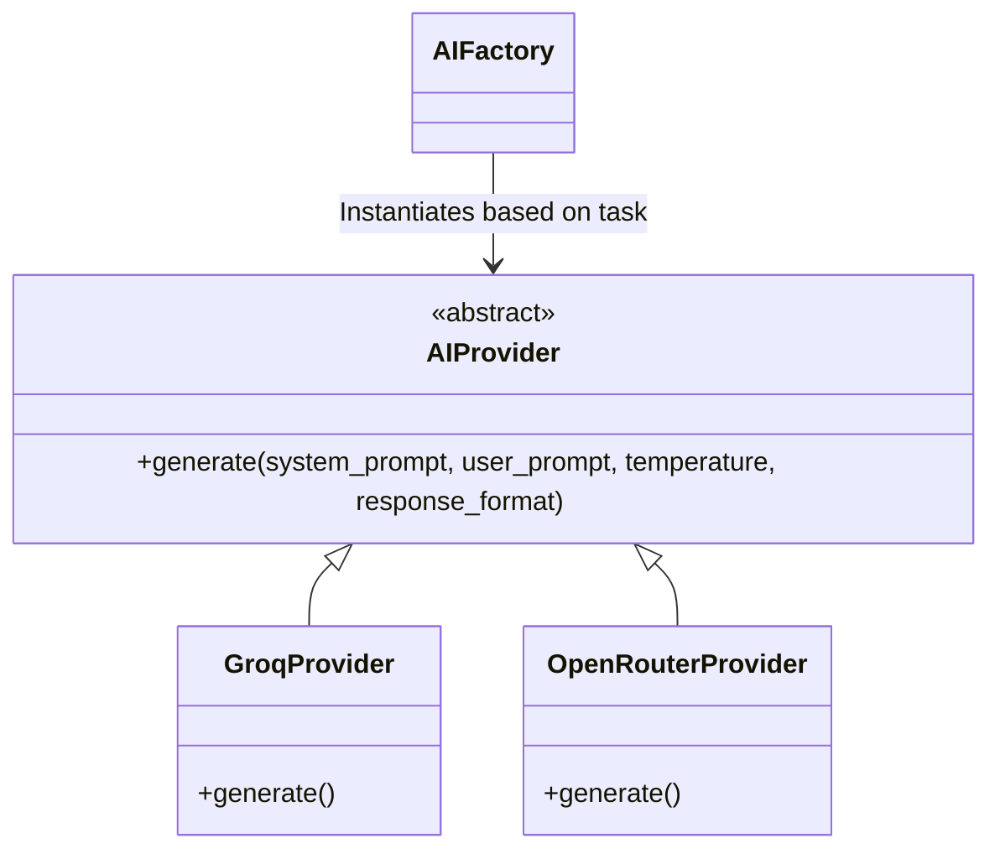

# AI Infrastructure

Lingofy leverages state-of-the-art Large Language Models (LLMs) to provide real-time dictionary definitions, grammar breakdowns, poetry translations, and pronunciation coaching.

## 1. Provider Architecture (Factory Pattern)

The backend utilizes an abstract `AIProvider` base class. This allows seamless switching between different models and API gateways without modifying business logic.

- **OpenRouterProvider:** Connects to OpenRouter. Useful for routing between `google/gemini-2.5-flash`, `openai/gpt-4o-mini`, and other cost-effective models.
- **GroqProvider:** Connects directly to Groq's high-speed inference engine. Used primarily for real-time lyrics translation (`llama-3.3-70b-versatile`).



## 2. Structured Output & Validation

When the frontend requires complex data (e.g., word definitions with examples, part-of-speech tags, and syllables), the AI must return strictly formatted JSON.

**Flow:**
1. System prompt strictly defines the expected JSON schema.
2. AI returns a JSON string.
3. Backend intercepts the string, strips markdown blocks (````json ... ````).
4. `json.loads` parses the string.
5. If parsing fails, a specialized **JSON Repair Mechanism** attempts to fix missing brackets or quotes.
6. If unrecoverable, the request is retried (up to 3 times) before throwing a 500 error.

## 3. Fallbacks and Reliability

AI endpoints are inherently volatile (Rate Limits, Timeouts). Lingofy guarantees a graceful degradation of service:

- **Translation Fallback:** If Groq limits are reached (`429 Too Many Requests`), the system catches the exception and routes the request to `DeepTranslator` (Google Translate wrapper). The user sees a translation instantly, completely unaware of the AI outage.
- **Dictionary Fallback:** Uses local caching. If the AI fails, it checks if a similar word was ever analyzed and retrieves it from the database (`user_words` table).

## 4. Pronunciation Engine (Whisper + LLM)

1. **Audio Transcription:** User audio is processed. (Future plan: whisper-1 API).
2. **Analysis Prompt:** The transcript and expected text are sent to the AI.
3. **Phoneme Scoring:** The AI evaluates accuracy, fluency, rhythm, and stress.
4. **Output:** Returns a score (0-100) and actionable feedback.

## 5. Caching Strategy

All AI responses are aggressively cached to minimize API costs and reduce latency from ~1000ms to 0ms.
- **Cache Store:** `TTLLRUCache`
- **TTL:** 24 Hours.
- **Key Generation:** Unique hashes based on `(Task_Type + User_Input)`.

---

*See [API.md](API.md) to view the endpoints exposing these AI features.*
