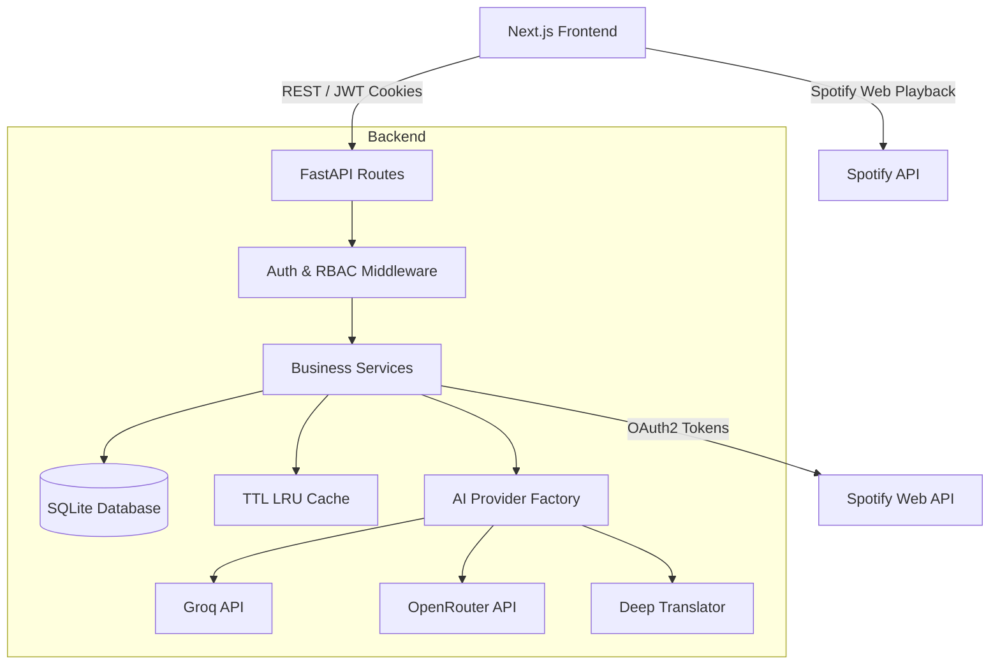
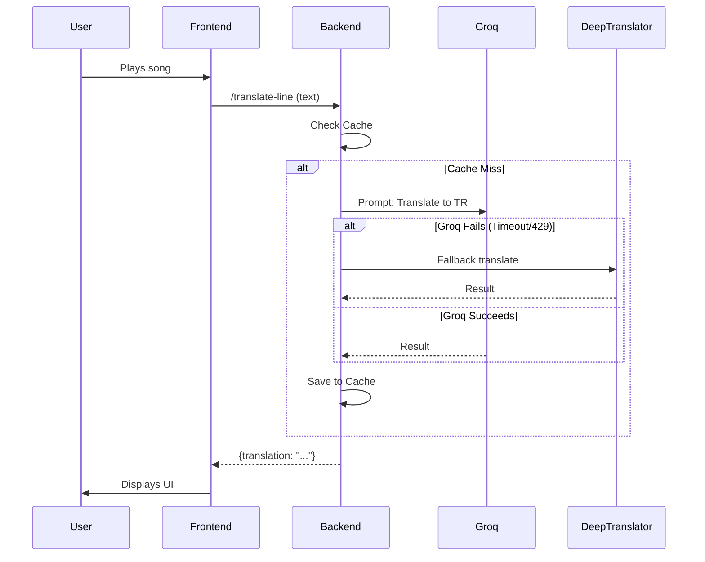

# Architecture Overview

Lingofy is built using a decoupled Client-Server architecture. This document provides an in-depth view of the system layers, dependency flow, and request lifecycles.

## 1. System Layers

- **Client Layer (Frontend):** Next.js single-page application. Handles audio context, state management, UI rendering, and Spotify SDK interactions.
- **API Layer (Backend):** FastAPI Python application. Manages routes, request validation (Pydantic), rate limiting, and session security.
- **Service Layer:** Business logic handling caching, Spotify API wrappers, and database transactions.
- **AI/Provider Layer:** Factory-pattern based abstraction for calling LLMs (Groq, OpenRouter) and translation services (DeepTranslator).
- **Data Layer:** SQLite relational database managing users, subscriptions, learning progress, and cache store.

## 2. Dependency Flow

## 3. Request Lifecycles

### Authentication Flow (HttpOnly Cookies)
1. User submits email/password to `/auth/login`.
2. Backend verifies hash, generates JWT `access_token` and `refresh_token`.
3. Tokens are set as `HttpOnly, Secure, SameSite=Lax` cookies in the response.
4. Subsequent requests automatically include cookies.
5. If `access_token` expires, frontend calls `/auth/refresh` to get a new one seamlessly.

### Translation Flow (Lyrics)
1. Frontend detects the current song and fetches lyrics via `/lyrics`.
2. Frontend pre-fetches translation for the current and nearby lines via `/translate-line` (Max Concurrency: 3).
3. Backend checks `TTLLRUCache` (24h expiry).
4. On Cache Miss: Backend calls `GroqProvider` (Llama-3-70b).
5. If Groq times out or rate limits (429), it falls back to `DeepTranslator` (Google Translate).
6. Result is cached and returned to the client.

### Pronunciation Flow
1. User holds the microphone button; browser records `WebM/Ogg` audio.
2. Blob is sent to `/api/pronunciation/analyze` as `FormData`.
3. Backend sends audio to OpenRouter/Whisper for transcription.
4. Extracted transcript is compared to the `expected_text`.
5. AI analyzes phonemes, stress, and rhythm.
6. DB updates `pronunciation_sessions` and `pronunciation_profiles` (XP, accuracy).
7. Score and detailed feedback are returned to the user.

## 4. Error Handling & Logging

- **FastAPI Exception Handlers:** Standardized JSON error responses (`{"detail": "..."}`).
- **Retry Logic:** Network requests to Spotify and AI providers use `asyncio.sleep` and exponential backoff.
- **Logging:** Python `logging` module captures Provider usage, latency, and cache hits/misses.

---

*See [AI.md](AI.md) for details on the AI Architecture.*
*See [DATABASE.md](DATABASE.md) for data storage details.*
