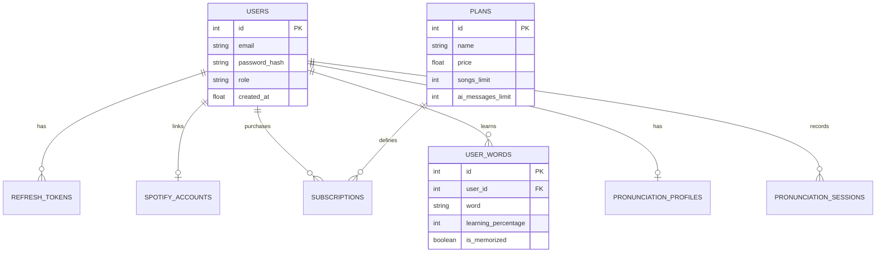

# Database Schema

Lingofy uses **SQLite3** as its primary database. The schema is highly normalized and designed to handle Authentication, Spotify OAuth, Subscription Tiering, and Pronunciation Analytics.

## 1. ER Diagram



## 2. Core Tables

### `users`
Stores core identity.
- `id`: Primary Key
- `email`: Unique identifier
- `password_hash`: Bcrypt hash
- `role`: `USER` or `ADMIN`

### `spotify_accounts`
Stores OAuth2 tokens for Spotify Web API.
- `user_id`: Foreign Key
- `access_token`: Spotify access token
- `refresh_token`: Used to get new access tokens when they expire (1hr).

### `user_words`
Tracks vocabulary mastery.
- `word`: The vocabulary term.
- `learning_percentage`: 0-100 metric based on spaced repetition.
- `is_memorized`: Boolean flag.
- `mastery_level`: "New", "Familiar", "Mastered".

## 3. Pronunciation & AI Memory

### `pronunciation_profiles`
Aggregated statistics for a user's speaking ability.
- `avg_accuracy`, `avg_fluency`, `avg_rhythm`
- `cefr_level`: e.g., A1, B2.
- `total_xp`

### `pronunciation_sessions`
Logs every single microphone recording.
- `lyrics_line`: What the user tried to say.
- `audio_path`: S3/Local path to the WebM file.
- `transcript`: What the Whisper AI heard.
- `overall_score`: Aggregate 0-100 score.

## 4. Monetization (SaaS)

### `plans`
Defines feature flags and limits for Free, Pro, and Master tiers.
- `songs_limit`, `ai_messages_limit`, `shadowing_limit`.
- `has_pdf_report`, `has_ai_mentor`.

### `subscriptions`
Links a user to a plan.
- `status`: `ACTIVE`, `CANCELED`, `PAST_DUE`.
- `expires_at`: Epoch timestamp.

## 5. Indexes and Performance

To ensure fast lookups on heavily queried tables, the following indexes are maintained:
- `idx_pronunciation_sessions_user_id` on `pronunciation_sessions(user_id)`
- `idx_pronunciation_goals_user_id_completed` on `pronunciation_goals(user_id, completed)`
- `UNIQUE(user_id, word)` on `user_words` to prevent duplicate dictionary entries.

## 6. Migration Strategy

Lingofy uses an idempotent auto-migration script within `db.py`:
```python
def auto_migrate_table(conn, table_name, desired_columns):
    # Runs PRAGMA table_info, checks missing columns, and executes ALTER TABLE ADD COLUMN.
```
This ensures zero-downtime updates when adding new features without dropping tables.
