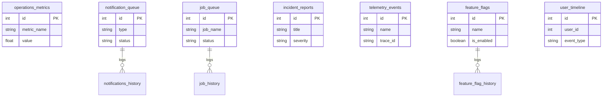

# Database Schema (Operations Console Extensions)

This document contains the newly added tables from Sprint 4A (Infrastructure). These tables are isolated to the `backend/admin/migrations/` system. Existing tables are NOT affected.

## 1. Metrics (`migration_007_metrics.py`)
- `operations_metrics`
- `provider_metrics`

## 2. Notifications (`migration_008_notifications.py`)
- `notification_queue`
- `notifications_history`

## 3. Queue (`migration_009_queue.py`)
- `job_queue`
- `job_history`
- `background_jobs`

## 4. Configuration (`migration_010_configuration.py`)
- `feature_flags`
- `feature_flag_history`
- `runtime_configuration`

## 5. Incidents (`migration_011_incidents.py`)
- `incident_reports`

## 6. Timeline (`migration_012_timeline.py`)
- `user_timeline`
- `audit_events`

## 7. Observability (`migration_013_observability.py`)
- `telemetry_events`
- `request_logs`
- `system_snapshots`
- `health_snapshots`

## 8. Exports (`migration_014_exports.py`)
- `exports`
- `export_jobs`

## Entity Relationship Diagram (Operations Backend)

*These tables utilize cursor pagination internally and avoid `OFFSET`. For dependency relations, refer to the individual migration files.*
