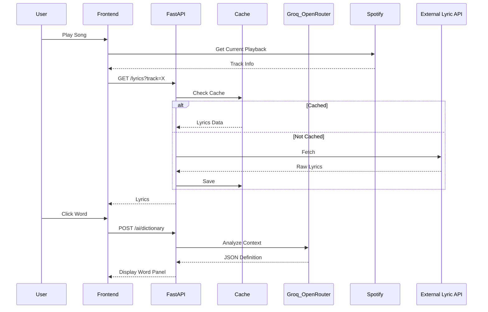

# Technical Architecture Document

## 1. Overview
Lingofy follows a decoupled client-server architecture. The backend is an asynchronous REST API built with Python (FastAPI), while the frontend is a modern React application built with Next.js (App Router).

## 2. Frontend Architecture
- **Framework:** Next.js 16.2 (Turbopack)
- **State Management:** Zustand for global state, React Context for specific domains (like Audio).
- **Styling:** Custom CSS with Tailwind CSS utilities.
- **Performance:** Extensive use of `React.memo` and `useCallback` to achieve O(1) rendering on complex DOM structures (like the 500+ line Lyrics Player) to maintain a smooth 60fps experience during real-time sync.

## 3. Backend Architecture
- **Framework:** FastAPI (Python 3.14)
- **Concurrency:** Asynchronous non-blocking I/O (`async def`) for all external API calls.
- **Logging:** Centralized `LingofyLogger` injecting latency, provider, and status metadata into every request.

## 4. Authentication System
- **Strategy:** Stateless JWT (JSON Web Tokens).
- **Storage:** Secure, `HttpOnly` cookies to mitigate XSS attacks.
- **Rotation:** Short-lived access tokens (e.g., 15 mins) and long-lived refresh tokens stored securely.
- **Password Hashing:** Argon2 via `passlib`.

## 5. AI Layer & Provider System
- **Factory Pattern:** AI providers are abstracted behind `ai_factory.py`.
- **LLM Routing:** `OpenRouter` is used as the primary LLM gateway to route requests to the most efficient models (e.g., Llama 3, Claude).
- **STT (Speech-to-Text):** `GroqWhisperProvider` utilizes Groq's LPU architecture for near-instantaneous audio transcription and phoneme analysis during the pronunciation coaching phase.

## 6. Caching & Resilience
- **Caching:** Currently implemented using a custom `TTLLRUCache` for in-memory fast retrieval (e.g., translated lyrics are cached for 24 hours).
- **Retry Mechanisms:** External API calls (Spotify, LRCLIB, OpenRouter) are wrapped in custom retry logic with exponential backoff (`_execute_with_retry`).
- **Timeouts:** Hard limits (e.g., 5s, 15s) on external requests to prevent hanging threads.

## 7. Database
- **Current Stack:** SQLite with `PRAGMA journal_mode=WAL` (Write-Ahead Logging) and `threading.RLock`.
- **Concurrency:** Thread-safe connections with strict timeout handling to prevent `database is locked` exceptions during high multi-user concurrent loads.
- **Migration Path:** The schema is strictly relational, preparing for an immediate transition to PostgreSQL using SQLAlchemy (Sprint 2).

## 8. Premium & Rate Limiting System
- **Atomic Operations:** Feature usage (e.g., translating a word, analyzing pronunciation) uses an atomic check-and-increment model.
- **Race Condition Prevention:** Implemented a Try-Revert logic locked under an RLock. If an AI call fails *after* a user's usage limit is incremented, the system safely catches the exception and refunds the usage point.

## 9. API Flow Diagram

